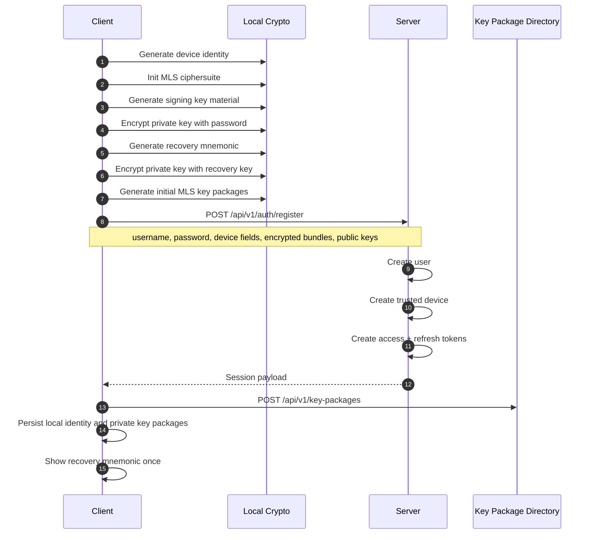
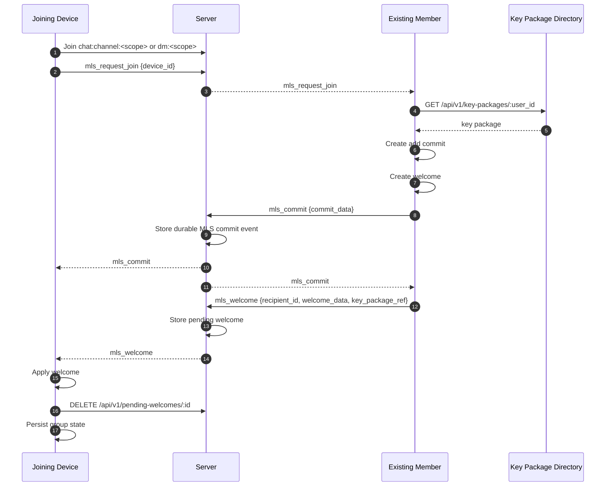
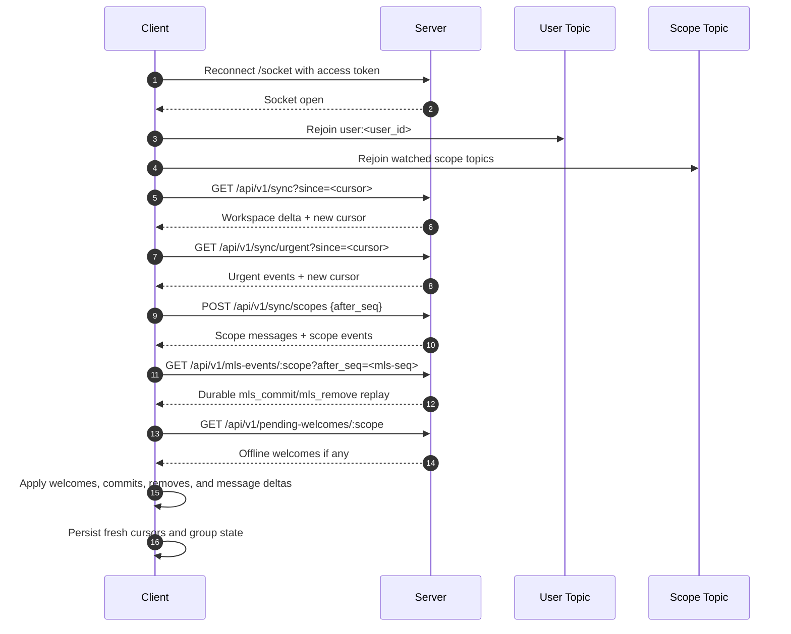
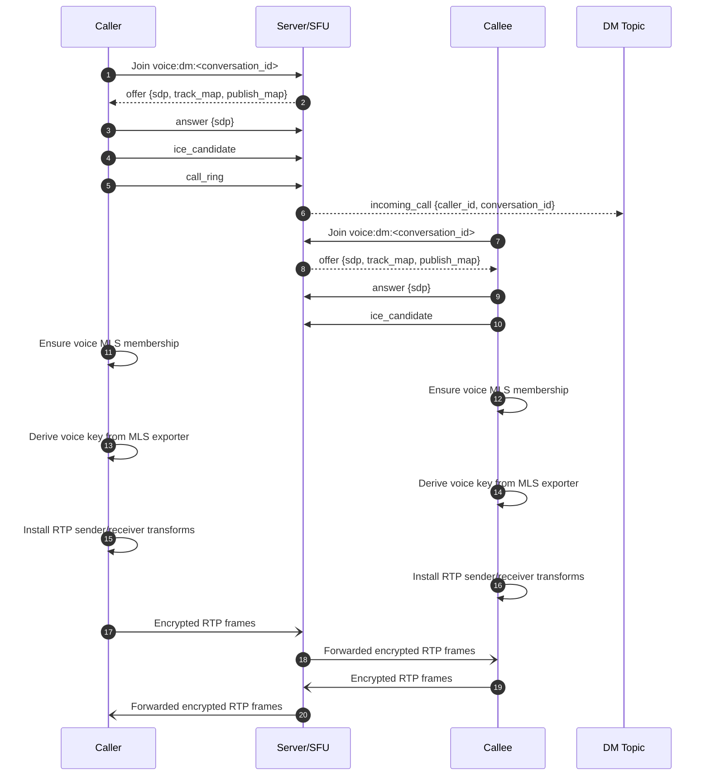
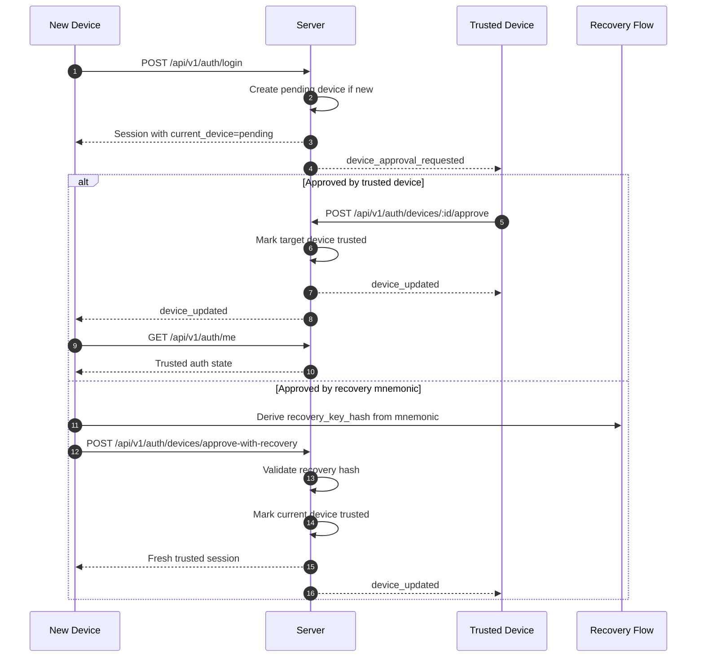
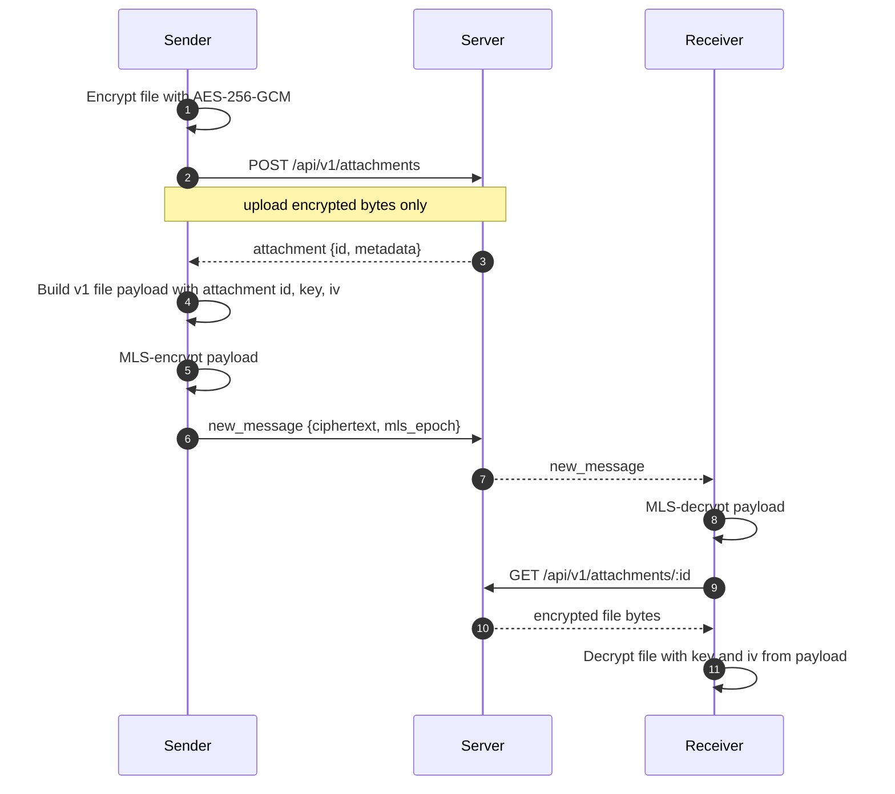
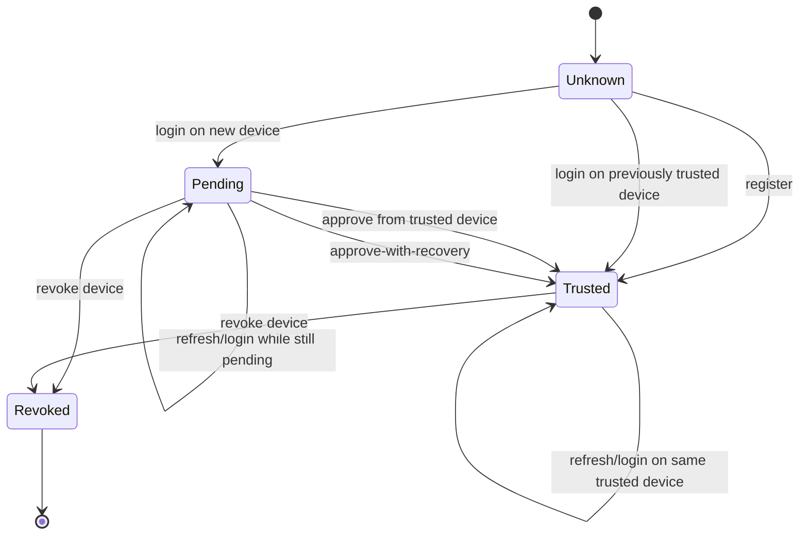
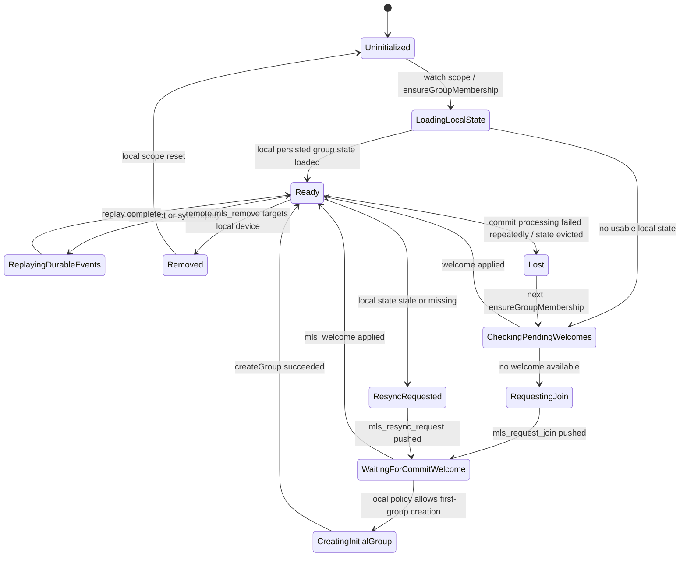
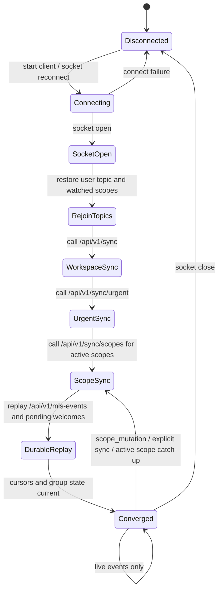
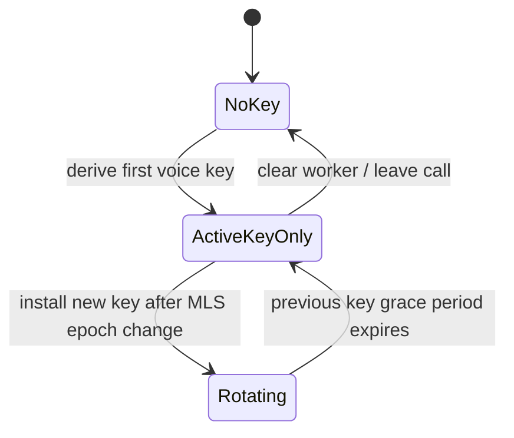

# Vesper Protocol Spec

This document describes the current wire protocol implemented in this repository. It is based on the Phoenix router, controllers, channels, sync helpers, and SDK transport code in the current tree.

This is an implementation spec, not a separate versioned standard. If code and this document disagree, the code wins.

Primary sources:

- `server/lib/vesper_web/router.ex`
- `server/lib/vesper_web/controllers/*.ex`
- `server/lib/vesper_web/channels/*.ex`
- `server/lib/vesper/runtime.ex`
- `server/lib/vesper/sync.ex`
- `sdk/src/api/*.ts`
- `sdk/src/auth/session.ts`

## 1. Transport and shared conventions

### 1.1 Base transport

- HTTP API base path: `/api/v1`
- WebSocket endpoint: `/socket`
- Socket auth: Phoenix socket param `token=<access JWT>`
- Socket transport settings:
  - compression enabled
  - max frame size `1_048_576`
  - websocket timeout `45_000ms`

### 1.2 Auth model

- Access token: JWT, sent as `Authorization: Bearer <token>` on HTTP and as the `token` socket param on WebSocket connect.
- Refresh token: opaque token, exchanged over `POST /api/v1/auth/refresh`
- Many crypto endpoints also require the current device to be trusted.

### 1.3 Common value formats

- IDs are UUID strings unless noted otherwise.
- Timestamps are ISO-8601 UTC datetimes.
- Binary blobs in JSON are base64 strings.
- Sync cursors are opaque base64url strings produced by `Vesper.SyncCursor`.
- `room_seq` is the per-scope ordered sequence for message and mutation replay.
- MLS durable event `seq` is a separate sequence in the MLS event log, not the same as `room_seq`.

### 1.4 Scope kinds and topic naming

- Text channel scope: `kind = "channel"`, scope id is the channel UUID
- DM scope: `kind = "dm"`, scope id is the conversation UUID
- Voice channel MLS group id: `voice:channel:<channel_id>`
- Voice DM MLS group id: `voice:dm:<conversation_id>`

Phoenix topics:

- `chat:channel:<channel_id>`
- `dm:<conversation_id>`
- `voice:channel:<channel_id>`
- `voice:dm:<conversation_id>`
- `user:<user_id>`
- `presence:server:<server_id>`
- `scope:dm:<conversation_id>`

### 1.5 Error format

Most failures return one of these shapes:

- `{ "error": "message" }`
- `{ "errors": { "field": ["message"] } }`
- Phoenix channel reply error: `{ "reason": "message" }`

## 2. Canonical JSON shapes

### 2.1 User

```json
{
  "id": "uuid",
  "username": "alice",
  "display_name": "Alice",
  "avatar_url": "/api/v1/avatars/...",
  "banner_url": "/api/v1/banners/...",
  "status": "online"
}
```

### 2.2 Device

```json
{
  "id": "uuid",
  "client_id": "stable-device-id",
  "name": "Alice's laptop",
  "platform": "electron",
  "trust_state": "pending",
  "approval_method": "registration",
  "trusted_at": "2026-03-21T10:00:00Z",
  "revoked_at": null,
  "last_seen_at": "2026-03-21T12:00:00Z",
  "push_token": null,
  "push_platform": null,
  "background_sync_capable": false,
  "notification_public_key": "base64-or-null",
  "inserted_at": "2026-03-21T10:00:00Z"
}
```

### 2.3 Channel

Full channel form used by sync and channel endpoints:

```json
{
  "id": "uuid",
  "server_id": "uuid",
  "name": "general",
  "type": "text",
  "category_id": null,
  "topic": null,
  "position": 0,
  "disappearing_ttl": null,
  "permission_overrides": {
    "roles": [
      {
        "role_id": "uuid",
        "allow": ["view_channel"],
        "deny": ["send_messages"],
        "allow_bits": 1024,
        "deny_bits": 2048
      }
    ],
    "users": []
  },
  "inserted_at": "2026-03-21T10:00:00Z",
  "updated_at": "2026-03-21T10:00:00Z"
}
```

Compact channel form used inside some server payloads omits `category_id`, `permission_overrides`, and timestamps.

### 2.4 Server

```json
{
  "id": "uuid",
  "name": "My Server",
  "icon_url": "/api/v1/servers/<id>/icon",
  "owner_id": "uuid",
  "channels": [/* channel objects */],
  "emojis": [/* emoji objects */],
  "inserted_at": "2026-03-21T10:00:00Z",
  "updated_at": "2026-03-21T10:00:00Z"
}
```

### 2.5 Conversation

```json
{
  "id": "uuid",
  "type": "dm",
  "name": null,
  "disappearing_ttl": null,
  "inserted_at": "2026-03-21T10:00:00Z",
  "participants": [
    {
      "id": "uuid",
      "user_id": "uuid",
      "joined_at": "2026-03-21T10:00:00Z",
      "user": {/* user */}
    }
  ],
  "last_message": null
}
```

### 2.6 Message

Full history form:

```json
{
  "id": "uuid",
  "room_seq": 42,
  "channel_id": "uuid-or-null",
  "conversation_id": "uuid-or-null",
  "sender_id": "uuid",
  "sender": {
    "id": "uuid",
    "username": "alice",
    "display_name": "Alice",
    "avatar_url": null
  },
  "expires_at": null,
  "parent_message_id": null,
  "thread_root_message_id": null,
  "reply_to_message_id": null,
  "inserted_at": "2026-03-21T10:00:00Z",
  "ciphertext": "base64",
  "mls_epoch": 7,
  "attachments": [
    {
      "id": "uuid",
      "filename": "photo.jpg",
      "content_type": "image/jpeg",
      "size_bytes": 1234,
      "encrypted": true
    }
  ],
  "reactions": [
    {
      "id": "uuid",
      "emoji": "encrypted-or-plain",
      "ciphertext": "base64-or-null",
      "mls_epoch": 7,
      "sender_id": "uuid",
      "inserted_at": "2026-03-21T10:00:00Z"
    }
  ]
}
```

Notes:

- Encrypted messages use `ciphertext` plus `mls_epoch`.
- Plaintext fallback messages use `content` instead of `ciphertext`.
- `thread_root_message_id` means the message belongs to a thread rooted at that top-level message.
- `reply_to_message_id` points at the specific message being replied to. It is independent of thread membership and can appear in either the main timeline or a thread.
- `parent_message_id` is retained as a legacy compatibility field during the migration away from the old overloaded parent model.
- Sync summary payloads redact encrypted bodies as `"encrypted"` instead of returning ciphertext.

### 2.7 Emoji

```json
{
  "id": "uuid",
  "name": "party_blob",
  "url": "/api/v1/servers/<server_id>/emojis/<emoji_id>/file",
  "animated": false,
  "server_id": "uuid",
  "creator": {
    "id": "uuid",
    "username": "alice",
    "display_name": "Alice",
    "avatar_url": null
  }
}
```

### 2.8 Role

```json
{
  "id": "uuid",
  "server_id": "uuid",
  "name": "moderator",
  "color": "#00aaff",
  "permissions": 12345,
  "position": 1
}
```

### 2.9 Invite

```json
{
  "id": "uuid",
  "code": "ABCDEFGH",
  "role_id": null,
  "max_uses": null,
  "uses": 0,
  "expires_at": null,
  "creator": {
    "id": "uuid",
    "username": "alice",
    "display_name": "Alice"
  },
  "inserted_at": "2026-03-21T10:00:00Z"
}
```

## 3. HTTP API

### 3.1 Public endpoints

| Method | Path | Purpose | Request body | Response |
| --- | --- | --- | --- | --- |
| `GET` | `/health` | Liveness/readiness probe | none | `{ "status": "ok|error", "migrations": "...", "database": "..." }` |
| `POST` | `/api/v1/auth/register` | Create account and first trusted device | `username`, `password`, `device_id`, `device_name`, `device_platform`, optional crypto bundle fields | Session payload |
| `POST` | `/api/v1/auth/login` | Log in and register or reuse a device | `username`, `password`, `device_id`, `device_name`, `device_platform` | Session payload |
| `POST` | `/api/v1/auth/refresh` | Exchange refresh token | `refresh_token` | New tokens and `current_device` |
| `POST` | `/api/v1/auth/logout` | Revoke refresh token if supplied | optional `refresh_token` | `{ "ok": true }` |
| `POST` | `/api/v1/auth/recover` | Validate recovery key hash | `recovery_key_hash` | `{ "user_id": "...", "encrypted_recovery_bundle": "base64" }` or error |
| `POST` | `/api/v1/auth/recover/reset` | Reset password via recovery key and create a trusted device | `recovery_key_hash`, `new_password`, device fields, crypto bundle fields | Session payload |
| `GET` | `/api/v1/avatars/:user_id` | Fetch avatar bytes | none | image or `{ "error": "no avatar" }` |
| `GET` | `/api/v1/banners/:user_id` | Fetch banner bytes | none | image or `{ "error": "no banner" }` |
| `GET` | `/api/v1/servers/:server_id/icon` | Fetch server icon bytes | none | image or error |
| `GET` | `/api/v1/servers/:server_id/emojis/:emoji_id/file` | Fetch custom emoji bytes | none | image or error |

Session payload:

```json
{
  "user": {/* user */},
  "access_token": "jwt",
  "refresh_token": "opaque",
  "expires_in": 900,
  "current_device": {/* device */},
  "encrypted_key_bundle": "base64-optional",
  "key_bundle_salt": "base64-optional",
  "key_bundle_nonce": "base64-optional",
  "public_identity_key": "base64-optional",
  "public_key_exchange": "base64-optional"
}
```

Crypto bundle fields appear on registration, recovery reset, and on authenticated state fetch when the current device is trusted.

### 3.2 Authenticated account endpoints

| Method | Path | Purpose | Request body | Response |
| --- | --- | --- | --- | --- |
| `GET` | `/api/v1/auth/me` | Current auth state | none | `{ "user": ..., "current_device": ..., optional crypto fields }` |
| `GET` | `/api/v1/auth/devices` | List devices for current account | none | `{ "devices": [...], "current_device": ... }` |
| `PUT` | `/api/v1/auth/devices/current/notifications` | Update push and notification settings for current device | any of `push_token`, `push_platform`, `background_sync_capable`, `notification_public_key` | `{ "current_device": ... }` |
| `POST` | `/api/v1/auth/devices/approve-with-recovery` | Trust current device using recovery key | `recovery_key_hash` | Session payload |
| `PUT` | `/api/v1/auth/profile` | Update profile | any of `display_name`, `avatar_url`, `banner_url`, `status` | `{ "user": ... }` |
| `PUT` | `/api/v1/auth/password` | Change password and optionally replace encrypted bundle | `old_password`, `new_password`, optional crypto fields | `{ "ok": true }` |
| `POST` | `/api/v1/auth/avatar` | Upload avatar | multipart `file` | `{ "user": ... }` |
| `POST` | `/api/v1/auth/banner` | Upload banner | multipart `file` | `{ "user": ... }` |

### 3.3 Trusted-device auth endpoints

These require both a valid user session and a trusted current device.

| Method | Path | Purpose | Request body | Response |
| --- | --- | --- | --- | --- |
| `POST` | `/api/v1/auth/devices/:id/approve` | Approve another device | none | `{ "device": ... }` |
| `POST` | `/api/v1/auth/devices/:id/revoke` | Revoke another device | none | `{ "device": ... }` |

### 3.4 Server and channel endpoints

| Method | Path | Purpose | Request body | Response |
| --- | --- | --- | --- | --- |
| `GET` | `/api/v1/servers` | List servers visible to user | none | `{ "servers": [server...] }` |
| `POST` | `/api/v1/servers` | Create server | typically `name` | `{ "server": server }` |
| `GET` | `/api/v1/servers/:id` | Fetch one server | none | `{ "server": server }` |
| `PUT` | `/api/v1/servers/:id` | Update server | top-level server attrs such as `name` or `icon_url` | `{ "server": server }` |
| `DELETE` | `/api/v1/servers/:id` | Delete server | none | `{ "ok": true }` |
| `POST` | `/api/v1/servers/:server_id/icon` | Upload server icon | multipart `file` | `{ "server": server }` |
| `POST` | `/api/v1/servers/join` | Join by invite code or current rotating server invite code | `{ "invite_code": "..." }` | `{ "server": server }` |
| `DELETE` | `/api/v1/servers/:server_id/leave` | Leave server | none | `{ "ok": true }` |
| `GET` | `/api/v1/servers/:server_id/invite-code` | Fetch the current rotating server invite code | none | `{ "invite_code": "..." }` |
| `GET` | `/api/v1/servers/:server_id/channels` | List channels | none | `{ "channels": [channel...] }` |
| `POST` | `/api/v1/servers/:server_id/channels` | Create channel | `name`, optional `type`, `topic`, `position`, `category_id`, `disappearing_ttl` | `{ "channel": channel }` |
| `GET` | `/api/v1/servers/:server_id/channels/:id` | Fetch channel | none | `{ "channel": channel }` |
| `PUT` | `/api/v1/servers/:server_id/channels/:id` | Update channel | any channel attrs plus optional `permission_overrides` | `{ "channel": channel }` |
| `DELETE` | `/api/v1/servers/:server_id/channels/:id` | Delete channel | none | `{ "ok": true }` |

`permission_overrides` shape:

```json
{
  "roles": [
    {
      "role_id": "uuid",
      "allow": ["view_channel"],
      "deny": ["send_messages"]
    }
  ],
  "users": [
    {
      "user_id": "uuid",
      "allow": ["view_channel"],
      "deny": []
    }
  ]
}
```

Response overrides add `allow_bits` and `deny_bits`.

### 3.5 Membership, ban, role, invite, and emoji endpoints

| Method | Path | Purpose | Request body | Response |
| --- | --- | --- | --- | --- |
| `GET` | `/api/v1/servers/:server_id/members` | List members | none | `{ "members": [...] }` |
| `DELETE` | `/api/v1/servers/:server_id/members/:user_id` | Kick member | none | `{ "ok": true }` |
| `POST` | `/api/v1/servers/:server_id/members/:user_id/ban` | Ban member | optional `reason` | `{ "ban": ... }` |
| `DELETE` | `/api/v1/servers/:server_id/members/:user_id/ban` | Unban member | none | `{ "ok": true }` |
| `GET` | `/api/v1/servers/:server_id/bans` | List bans | optional `limit` | `{ "bans": [...] }` |
| `GET` | `/api/v1/servers/:server_id/audit-logs` | List audit log entries | optional `limit` | `{ "audit_logs": [...] }` |
| `GET` | `/api/v1/servers/:server_id/invites` | List invite links | none | `{ "invites": [...] }` |
| `POST` | `/api/v1/servers/:server_id/invites` | Create invite link | optional `expires_in_seconds`, `max_uses`, `role_id` | `{ "invite": ... }` |
| `DELETE` | `/api/v1/servers/:server_id/invites/:invite_id` | Revoke invite link | none | `{ "ok": true }` |
| `GET` | `/api/v1/servers/:server_id/roles` | List roles | none | `{ "roles": [...] }` |
| `POST` | `/api/v1/servers/:server_id/roles` | Create role | `name`, `permissions`, optional `color`, optional `position` | `{ "role": ... }` |
| `PUT` | `/api/v1/servers/:server_id/roles/:role_id` | Update role | any role attrs | `{ "role": ... }` |
| `DELETE` | `/api/v1/servers/:server_id/roles/:role_id` | Delete role | none | `{ "ok": true }` |
| `PUT` | `/api/v1/servers/:server_id/members/:user_id/roles` | Update member roles | either `role` for legacy single-role mode or `role_ids` for multi-role replacement | `{ "ok": true }` |
| `GET` | `/api/v1/servers/:server_id/emojis` | List custom emoji | none | `{ "emojis": [...] }` |
| `POST` | `/api/v1/servers/:server_id/emojis` | Upload custom emoji | multipart `file`, optional `name` | `{ "emoji": ... }` |
| `PATCH` | `/api/v1/servers/:server_id/emojis/:emoji_id` | Rename emoji | `{ "name": "..." }` | `{ "emoji": ... }` |
| `DELETE` | `/api/v1/servers/:server_id/emojis/:emoji_id` | Delete emoji | none | `{ "ok": true }` |

### 3.6 Message, thread, conversation, and attachment endpoints

| Method | Path | Purpose | Request body / query | Response |
| --- | --- | --- | --- | --- |
| `GET` | `/api/v1/channels/:id/messages` | Channel history | query `limit`, `before`, `after`, `after_seq`, `lean` | `{ "messages": [message...] }` |
| `PUT` | `/api/v1/channels/:id/read` | Mark channel read | `{ "message_id": "..." }` | `{ "ok": true }` |
| `GET` | `/api/v1/channels/:id/pins` | List pinned messages | none | `{ "pins": [...] }` |
| `GET` | `/api/v1/messages` | Batch fetch by ids | query or body `ids` list/comma string | `{ "messages": [message...] }` |
| `GET` | `/api/v1/messages/:id` | Fetch one message | none | `{ "message": message }` |
| `GET` | `/api/v1/messages/:id/thread` | Fetch thread root and replies | query `limit` | `{ "parent": message, "messages": [...], "reply_count": 3 }` |
| `POST` | `/api/v1/conversations` | Create DM or group DM | `{ "participant_ids": ["..."], optional "name": "..." }` | `{ "conversation": conversation }` |
| `GET` | `/api/v1/conversations` | List conversations | none | `{ "conversations": [conversation...] }` |
| `GET` | `/api/v1/conversations/:id` | Fetch one conversation | none | `{ "conversation": conversation }` |
| `GET` | `/api/v1/conversations/:conversation_id/messages` | DM history | query `limit`, `before`, `after`, `after_seq`, `lean` | `{ "messages": [message...] }` |
| `PUT` | `/api/v1/conversations/:conversation_id/read` | Mark DM read | `{ "message_id": "..." }` | `{ "ok": true }` |
| `POST` | `/api/v1/attachments` | Upload file blob | multipart `file`, optional `message_id`, optional `encrypted=true` | `{ "attachment": ... }` |
| `GET` | `/api/v1/attachments/:id` | Download file blob | none | raw file bytes |

Attachment response:

```json
{
  "attachment": {
    "id": "uuid",
    "filename": "photo.jpg",
    "content_type": "image/jpeg",
    "size_bytes": 1234,
    "message_id": null,
    "encrypted": true,
    "expires_at": "2026-04-20T10:00:00Z"
  }
}
```

### 3.7 Workspace sync, unread counts, and search

| Method | Path | Purpose | Request | Response |
| --- | --- | --- | --- | --- |
| `GET` | `/api/v1/unread` | Snapshot unread counts | none | `{ "channels": {id: count}, "conversations": {id: count} }` |
| `GET` | `/api/v1/sync` | Workspace snapshot or delta | optional `since` cursor | Workspace sync payload |
| `GET` | `/api/v1/sync/urgent` | Urgent event delta | optional `since`, optional `limit` | Urgent sync payload |
| `POST` | `/api/v1/sync/scopes` | Scope-specific history and mutation delta | `{ "scopes": [...], optional "limit", optional "since" }` | Scope sync payload |
| `GET` | `/api/v1/users/search?username=...` | Exact username lookup, minimum length 2 | query | `{ "users": [user...] }` |
| `GET` | `/api/v1/voice/config` | ICE/TURN config | none | `{ "ice_servers": [...], "ice_transport_policy": "all|relay" }` |

Workspace sync payload:

```json
{
  "token": "opaque-cursor",
  "full": true,
  "servers": [/* server objects */],
  "conversations": [/* conversation objects with last_message */],
  "conversation_resets": [
    {
      "conversation_id": "uuid",
      "last_message": null
    }
  ],
  "channel_activity": [
    {
      "channel_id": "uuid",
      "message_id": "uuid-or-null",
      "inserted_at": "2026-03-21T10:00:00Z",
      "sender_id": "uuid-or-null",
      "sender": {/* sender preview or null */}
    }
  ],
  "unread_counts": {
    "channels": {},
    "conversations": {}
  }
}
```

Scope sync request:

```json
{
  "since": "opaque-cursor",
  "limit": 50,
  "scopes": [
    { "kind": "channel", "id": "uuid", "after": "message-id", "after_seq": 42 },
    { "kind": "dm", "id": "uuid" }
  ]
}
```

Scope sync response:

```json
{
  "token": "opaque-cursor",
  "scopes": [
    {
      "scope_id": "uuid",
      "kind": "channel",
      "has_more": false,
      "messages": [/* full message objects */],
      "events": [
        {
          "id": 123,
          "room_seq": 77,
          "event_type": "message_deleted",
          "message_id": "uuid-or-null",
          "inserted_at": "2026-03-21T10:00:00Z",
          "payload": {}
        }
      ]
    }
  ]
}
```

Urgent sync response:

```json
{
  "token": "opaque-cursor",
  "events": [
    {
      "id": 999,
      "scope_kind": "channel",
      "scope_id": "uuid",
      "event_type": "urgent_message",
      "inserted_at": "2026-03-21T10:00:00Z",
      "payload": {
        "message_id": "uuid",
        "room_seq": 42,
        "sender_id": "uuid",
        "urgent_reason": "mention",
        "mentions_you": true,
        "reply_to_you": false,
        "is_dm": false
      }
    }
  ]
}
```

### 3.8 Trusted-device crypto endpoints

| Method | Path | Purpose | Request | Response |
| --- | --- | --- | --- | --- |
| `GET` | `/api/v1/search-index` | Fetch encrypted local-search snapshot | none | `{ "snapshot": snapshot-or-null }` |
| `PUT` | `/api/v1/search-index` | Upsert encrypted local-search snapshot | `device_id`, `ciphertext`, `nonce`, optional `expected_version` | `{ "snapshot": ... }` or `409 version_conflict` |
| `DELETE` | `/api/v1/search-index` | Delete encrypted local-search snapshot | none | `{ "ok": true }` |
| `POST` | `/api/v1/key-packages` | Upload MLS key packages | `{ "key_packages": ["base64", ...], optional "device_id": "..." }` | `{ "uploaded": <count> }` |
| `GET` | `/api/v1/key-packages/me/count` | Count unconsumed key packages for current device | none | `{ "count": 12 }` |
| `DELETE` | `/api/v1/key-packages/me` | Purge unconsumed key packages for current device | none | `{ "purged": 12 }` |
| `GET` | `/api/v1/key-packages/:user_id` | Fetch and consume one key package | optional query `device_id` | `{ "key_package": "base64" }` |
| `GET` | `/api/v1/pending-welcomes/:channel_id` | Fetch pending MLS welcome messages for a scope | scope id or voice scope string | `{ "welcomes": [...] }` |
| `DELETE` | `/api/v1/pending-welcomes/:id` | Ack pending welcome | none | `{ "ok": true }` |
| `GET` | `/api/v1/mls-events/:channel_id` | Durable MLS control-plane replay | query `after_seq`, `limit` | `{ "events": [...] }` |
| `GET` | `/api/v1/pending-resync-requests/:channel_id` | Fetch stored resync requests | scope id or voice scope string | `{ "requests": [...] }` |
| `DELETE` | `/api/v1/pending-resync-requests/:id` | Ack pending resync request | none | `{ "ok": true }` |
| `GET` | `/api/v1/group-info/:scope_id` | Fetch the latest published GroupInfo for External Commit joins | scope id | `{ "group_info": { ... } }` or `404` |
| `PUT` | `/api/v1/group-info/:scope_id` | Publish GroupInfo, or atomically publish GroupInfo plus an External Commit | `group_info_data`, `epoch`, optional `previous_epoch`, optional `ratchet_tree_data`, optional `commit_data`, optional `commit_id` | `{ "ok": true, "fresh": boolean, ... }` or `409 epoch_conflict` |
| `POST` | `/api/v1/mls-sponsored-transition/:scope_id` | Atomically publish a sponsored remove/commit/welcome transition | `group_info_data`, `epoch`, `previous_epoch`, `recipient_id`, `commit_data`, `commit_id`, optional `remove_commit_data`, optional `welcome_data`, optional `recipient_device_id`, optional `recipient_key_package_ref` | `{ "ok": true, "fresh": boolean, "commit_event_seq": <id-or-null>, "remove_event_seq": <id-or-null>, "welcome_id": <id-or-null> }` or `409` |
| `GET` | `/api/v1/pending-history-requests/:channel_id` | Fetch same-user history requests | scope id | `{ "requests": [...] }` |
| `DELETE` | `/api/v1/pending-history-requests/:id` | Ack history request | none | `{ "ok": true }` |
| `GET` | `/api/v1/pending-history-bundles/:channel_id` | Fetch same-user history bundles | scope id | `{ "bundles": [...] }` |
| `DELETE` | `/api/v1/pending-history-bundles/:id` | Ack history bundle | none | `{ "ok": true }` |

Search snapshot shape:

```json
{
  "snapshot": {
    "version": 3,
    "device_id": "stable-device-id",
    "ciphertext": "base64",
    "nonce": "base64",
    "updated_at": "2026-03-21T10:00:00Z"
  }
}
```

Pending welcome item:

```json
{
  "id": "uuid",
  "welcome_data": "base64",
  "key_package_ref": "string-or-null",
  "sender_id": "uuid",
  "inserted_at": "2026-03-21T10:00:00Z"
}
```

MLS event item:

```json
{
  "seq": 55,
  "event_type": "mls_commit",
  "payload": {
    "commit_data": "base64-or-json-string"
  },
  "sender_id": "uuid",
  "sender_device_id": "stable-device-id",
  "inserted_at": "2026-03-21T10:00:00Z"
}
```

## 4. WebSocket protocol

### 4.1 Socket connect

Client connects to:

```text
ws(s)://<server>/socket?token=<access-token>
```

If the token is valid and the device is not revoked, the socket is accepted and tagged with:

- `user_id`
- `device_id`
- `device_client_id`
- `device_trust_state`
- `username`
- `display_name`

Socket id format:

```text
user_socket:<user_id>:<device_id>
```

Revoked devices are forcibly disconnected by broadcasting `disconnect` to that socket id.

### 4.2 Topic summary

| Topic | Join rule | Main purpose |
| --- | --- | --- |
| `chat:channel:<channel_id>` | user is a member and can view the channel | text-channel realtime messaging and MLS control |
| `dm:<conversation_id>` | user is a participant | DM realtime messaging and MLS control |
| `voice:channel:<channel_id>` | user is a member and channel type is `voice` | voice call signaling and voice MLS control |
| `voice:dm:<conversation_id>` | user is a DM participant | voice call signaling and voice MLS control |
| `user:<user_id>` | may only join your own user id | per-user notifications, unread, device updates |
| `presence:server:<server_id>` | user is a server member | presence plus server metadata mutations |
| `scope:dm:<conversation_id>` | user is a DM participant | lightweight scope mutation notifications |

### 4.3 `chat:channel:<channel_id>`

Client -> server events:

| Event | Payload |
| --- | --- |
| `new_message` | `{ "ciphertext": "base64", "mls_epoch": 7, optional "client_nonce", optional "thread_root_message_id", optional "reply_to_message_id", legacy optional "parent_message_id", optional "attachment_ids", optional "mentioned_user_ids" }` |
| `add_reaction` | either `{ "message_id": "uuid", "emoji": "👍" }` or `{ "message_id": "uuid", "ciphertext": "base64", optional "mls_epoch": 7 }` |
| `remove_reaction` | same shape as `add_reaction` |
| `edit_message` | `{ "message_id": "uuid", "ciphertext": "base64", "mls_epoch": 8 }` |
| `delete_message` | `{ "message_id": "uuid" }` |
| `pin_message` | `{ "message_id": "uuid" }` |
| `unpin_message` | `{ "message_id": "uuid" }` |
| `set_disappearing` | `{ "ttl": 3600 }` or `{ "ttl": null }` |
| `typing_start` | `{}` |
| `typing_stop` | `{}` |
| `mls_request_join` | optional `{ "device_id": "stable-device-id" }` |
| `mls_request_join_all` | `{}` |
| `mls_resync_request` | `{ "request_id": "string", optional "device_id", optional "last_known_epoch", optional "reason" }` |
| `mls_commit` | `{ "commit_data": "...", optional "idempotency_key": "sha256-or-client-key", optional "commit_id": "same-key" }` |
| `mls_eviction_claim` | `{ "id": "pending-eviction-id" }` |
| `mls_eviction_skip` | `{ "id": "pending-eviction-id", "target_user_id": "uuid", optional "target_device_id", optional "reason" }` |
| `mls_remove` | `{ "removed_user_id": "uuid", "commit_data": "...", optional "removed_device_id", optional "eviction_id" }` |
| `mls_welcome` | `{ "recipient_id": "uuid", "welcome_data": "base64", optional "recipient_device_id", optional "key_package_ref" }` |
| `mls_history_request` | optional `{ "device_id": "stable-device-id" }` |
| `mls_history_bundle` | `{ "ciphertext": "...", "mls_epoch": 7, "recipient_id": "uuid", optional "recipient_device_id" }` |

Server -> client events:

| Event | Payload |
| --- | --- |
| `new_message` | encrypted message payload with `channel_id`, `room_seq`, `ciphertext`, `mls_epoch`, sender, attachments, reactions, optional `client_nonce` |
| `reaction_update` | `{ "action": "add|remove", "message_id": "uuid", "sender_id": "uuid", optional "emoji", optional "ciphertext", optional "mls_epoch", optional "room_seq" }` |
| `message_edited` | `{ "message_id": "uuid", "ciphertext": "base64", "mls_epoch": 8, "edited_at": "...", "channel_id": "uuid", "room_seq": 99 }` |
| `message_deleted` | `{ "message_id": "uuid", "channel_id": "uuid", "latest_message": summary-or-null, "room_seq": 100 }` |
| `message_pinned` | `{ "channel_id": "uuid", "message_id": "uuid", "pinned_by": "uuid", "room_seq": 101 }` |
| `message_unpinned` | `{ "channel_id": "uuid", "message_id": "uuid", "room_seq": 102 }` |
| `disappearing_ttl_updated` | `{ "channel_id": "uuid", "disappearing_ttl": 3600 }` |
| `typing_start` | `{ "user_id": "uuid", "username": "alice" }` |
| `typing_stop` | `{ "user_id": "uuid" }` |
| `mls_request_join` | `{ "user_id": "uuid", "username": "alice", "device_id": "stable-device-id" }` |
| `mls_request_join_all` | `{ "user_id": "uuid" }` |
| `mls_resync_request` | `{ "id": "uuid", "user_id": "uuid", "username": "alice", "device_id": "stable-device-id", "request_id": "string", "last_known_epoch": 7, "reason": "..." }` |
| `mls_commit` | `{ "seq": 12, "commit_data": "...", "sender_id": "uuid", "sender_device_id": "stable-device-id" }` |
| `mls_remove` | `{ "seq": 13, "removed_user_id": "uuid", "commit_data": "...", "sender_id": "uuid", "sender_device_id": "stable-device-id", optional "removed_device_id", optional "eviction_id" }` |
| `mls_welcome` | `{ "id": "uuid", "recipient_id": "uuid", "recipient_device_id": "stable-device-id-or-null", "key_package_ref": "string-or-null", "welcome_data": "base64", "sender_id": "uuid" }` |
| `mls_history_request` | `{ "id": "uuid", "user_id": "uuid", optional "device_id": "stable-device-id" }` |
| `mls_history_bundle` | `{ "id": "uuid", "ciphertext": "...", "mls_epoch": 7, "recipient_id": "uuid", "recipient_device_id": "stable-device-id-or-null", "sender_id": "uuid" }` |

### 4.4 `dm:<conversation_id>`

The DM topic mirrors the channel topic for most events, but all scope ids are conversation ids.

Additional DM-specific server events:

| Event | Payload |
| --- | --- |
| `incoming_call` | `{ "caller_id": "uuid", "conversation_id": "uuid" }` |
| `call_rejected` | `{ "conversation_id": "uuid", "user_id": "uuid" }` |

DM-specific behavior:

- `typing_start` and `typing_stop` are broadcast on the DM topic and also mirrored to each participant's `user:<user_id>` topic as `dm_typing_start` and `dm_typing_stop`.
- `set_disappearing` updates the DM's conversation TTL, not a channel TTL.

### 4.5 `voice:channel:<channel_id>` and `voice:dm:<conversation_id>`

Client -> server events:

| Event | Payload |
| --- | --- |
| `answer` | `{ "sdp": "..." }` |
| `ice_candidate` | `{ "candidate": {...} }` |
| `mute` | `{ "muted": true }` |
| `media_state` | `{ "slot": "audio|video|screen", "active": true }` |
| `voice_key` | arbitrary JSON relayed to peers, server adds `sender_id` |
| `call_ring` | `{}` on DM voice topics only |
| `call_accept` | `{}` |
| `call_reject` | `{}` |
| `mls_request_join` | optional `{ "device_id": "stable-device-id" }` |
| `mls_request_join_all` | `{}` |
| `mls_resync_request` | same shape as chat/dm |
| `mls_commit` | `{ "commit_data": "...", optional "idempotency_key": "sha256-or-client-key", optional "commit_id": "same-key" }` |
| `mls_remove` | `{ "removed_user_id": "uuid", "commit_data": "..." }` |
| `mls_welcome` | same shape as chat/dm |

Server -> client events:

| Event | Payload |
| --- | --- |
| `offer` | `{ "sdp": "...", "track_map": {...}, "publish_map": {...}, "e2ee_creator_id": "uuid" }` |
| `ice_candidate` | `{ "candidate": {...} }` |
| `voice_state_update` | `{ "participants": [...] }` |
| `voice_key` | relayed payload plus `sender_id` |
| `call_timeout` | `{}` |
| `call_rejected` | `{ "user_id": "uuid" }` or DM form from `dm:<id>` |
| `error` | `{ "reason": "..." }` |
| `mls_request_join` | same shape as chat/dm |
| `mls_request_join_all` | same shape as chat/dm |
| `mls_resync_request` | same shape as chat/dm |
| `mls_commit` | `{ "commit_data": "...", "sender_id": "uuid", "sender_device_id": "stable-device-id" }` |
| `mls_remove` | `{ "removed_user_id": "uuid", "commit_data": "...", "sender_id": "uuid", "sender_device_id": "stable-device-id" }` |
| `mls_welcome` | same shape as chat/dm |

Voice participant payloads come from the voice subsystem and are returned as an opaque participant list from `Voice.get_participants/1`.

DM call ringing is surfaced on the DM messaging topic, not on the voice topic:

- topic: `dm:<conversation_id>`
- event: `incoming_call`
- payload: `{ "caller_id": "uuid", "conversation_id": "uuid" }`

### 4.6 `user:<user_id>`

Join rule: you may only join your own user topic.

Client -> server events:

| Event | Payload |
| --- | --- |
| `heartbeat` | `{}` |
| `set_status` | `{ "status": "online|idle|dnd" }` |

Server -> client events:

| Event | Payload |
| --- | --- |
| `presence_state` | standard Phoenix presence state keyed by user id |
| `presence_diff` | standard Phoenix presence diff |
| `mention` | `{ "channel_id": "uuid", "sender_id": "uuid" }` |
| `new_conversation` | `{ "conversation": conversation }` |
| `dm_message` | `{ "conversation_id": "uuid", "message_id": "uuid", "sender_id": "uuid", "sender": {...}, "inserted_at": "..." }` |
| `dm_typing_start` | `{ "conversation_id": "uuid", "payload": { "user_id": "uuid", "username": "alice" } }` |
| `dm_typing_stop` | `{ "conversation_id": "uuid", "payload": { "user_id": "uuid" } }` |
| `unread_update` | `{ "channel_id": "uuid", "message_id": "uuid", "inserted_at": "...", "sender_id": "uuid", "sender": {...} }` |
| `dm_unread_update` | `{ "conversation_id": "uuid", "message_id": "uuid" }` |
| `scope_summary_updated` | `{ "kind": "channel|dm", "scope_id": "uuid", "room_seq": 42, optional "channel_activity", optional "conversation_reset" }` |
| `mls_history_request_pending` | `{ "scope_id": "uuid", "topic": "chat:channel:<id>|dm:<id>" }` |
| `mls_history_bundle_pending` | `{ "scope_id": "uuid", "topic": "chat:channel:<id>|dm:<id>" }` |
| `server_membership_revoked` | `{ "server_id": "uuid", "channel_ids": ["uuid", ...], "reason": "kicked|banned|..." }` |
| `device_approval_requested` | `{ "device": device }` |
| `device_updated` | `{ "device": device }` |

### 4.7 `presence:server:<server_id>`

Server -> client events:

| Event | Payload |
| --- | --- |
| `presence_state` | standard Phoenix presence state keyed by user id |
| `presence_diff` | standard Phoenix presence diff |
| `channel_created` | `{ "server_id": "uuid", "channel": channel }` |
| `channel_updated` | `{ "server_id": "uuid", "channel": channel }` |
| `channel_deleted` | `{ "server_id": "uuid", "channel_id": "uuid" }` |
| `emoji_created` | emoji object |
| `emoji_updated` | emoji object |
| `emoji_deleted` | `{ "id": "uuid" }` |
| `server_members_updated` | `{ "server_id": "uuid", "event": "member_joined|member_left|member_banned|...", "user_id": "uuid" }` |
| `scope_mutation` | `{ "kind": "channel", "scope_id": "uuid" }` |

The current server emits `emoji_updated`. Some client allowlists still only enumerate `emoji_created` and `emoji_deleted`, so treat the server behavior as authoritative.

### 4.8 `scope:dm:<conversation_id>`

Server -> client events:

| Event | Payload |
| --- | --- |
| `scope_mutation` | `{ "kind": "dm", "scope_id": "uuid" }` |

## 5. Sync semantics

### 5.1 Workspace sync

`GET /api/v1/sync` is the coarse-grained snapshot and delta endpoint.

- No `since` cursor:
  - returns a full snapshot
  - sets `full: true`
- With `since`:
  - returns only changed servers, conversations, read-state deltas, and activity summaries
  - sets `full: false`

The sync token embeds:

- `synced_at`
- `user_sync_event_id`

On decode, the server shifts `synced_at` back by one second to avoid dropping events inserted in the same truncated second.

### 5.2 Scope sync

`POST /api/v1/sync/scopes` is the fine-grained replay endpoint.

Use it when you need:

- paginated history for one or more scopes
- mutation replay after a `room_seq`
- mutation replay after a broader workspace cursor

Rules:

- `after` paginates by message id/cursor
- `after_seq` replays by per-scope sequence number
- `events` contains non-message mutations only
- `messages` contains actual message rows
- `has_more` means more messages or events remain past the requested window

### 5.3 Urgent sync

`GET /api/v1/sync/urgent` returns only per-user urgent events, currently written as `event_type = "urgent_message"`.

Urgent payload flags:

- `urgent_reason`: `mention`, `mention_reply`, or `dm`
- `mentions_you`: boolean
- `reply_to_you`: boolean
- `is_dm`: boolean

### 5.4 Scope summaries

`scope_summary_updated` on the user topic is a lightweight summary event:

- channel updates carry `channel_activity`
- DM updates carry `conversation_reset`

Encrypted last-message bodies are intentionally summarized as `"encrypted"` instead of sending ciphertext again.

## 6. MLS and E2EE control plane

### 6.1 Key packages

- Uploaded through `POST /api/v1/key-packages`
- Fetched one-at-a-time through `GET /api/v1/key-packages/:user_id`
- Counted and purged for the current trusted device through `/me/count` and `/me`

### 6.2 Welcome delivery

MLS welcome messages are written by `mls_welcome` channel events and later fetched by the recipient through `GET /api/v1/pending-welcomes/:scope`.

For voice scopes, the path parameter is the synthetic group id string:

- `voice:channel:<channel_id>`
- `voice:dm:<conversation_id>`

### 6.3 Durable MLS event log

`GET /api/v1/mls-events/:scope` replays stored control-plane events after a durable `seq`.

Current durable event types:

- `mls_commit`
- `mls_remove`

### 6.4 Resync and history recovery

Resync flow:

1. Client emits `mls_resync_request` on the live topic.
2. Server stores it as a pending request.
3. Other devices receive it live and can also fetch it later through `/pending-resync-requests/:scope`.

Same-user history recovery flow:

1. Client emits `mls_history_request`.
2. Server stores it and notifies the user's other devices through `mls_history_request_pending`.
3. Another device answers with `mls_history_bundle`.
4. Server stores it and notifies the target device through `mls_history_bundle_pending`.
5. Target device fetches the stored bundle through `/pending-history-bundles/:scope`.

### 6.5 Crypto eviction flow

Chat and DM topics support:

- `mls_eviction_claim`
- `mls_eviction_skip`
- `mls_remove` with optional `eviction_id`

These are used to coordinate removal commits when membership changes require encrypted state cleanup. Voice topics do not expose the eviction claim and skip events.

## 7. Presence model

Vesper uses Phoenix Presence.

`presence_state` shape follows Phoenix conventions:

```json
{
  "user-uuid": {
    "metas": [
      {
        "status": "online",
        "joined_at": 1770000000,
        "phx_ref": "..."
      }
    ]
  }
}
```

`presence_diff` shape:

```json
{
  "joins": { /* presence_state fragment */ },
  "leaves": { /* presence_state fragment */ }
}
```

User topic heartbeat behavior:

- client sends `heartbeat`
- server resets a 5 minute timer
- if the timer fires, the server marks the user as `idle`

## 8. Known implementation quirks

- `GET /api/v1/mls-events/:scope` uses durable MLS `seq`, not room `room_seq`.
- `/api/v1/sync` and `scope_summary_updated` redact encrypted message bodies as the literal string `"encrypted"`.
- `POST /api/v1/key-packages` accepts a `device_id` field in SDK callers, but the controller keys uploads off the authenticated current device's `client_id`.
- The server emits `emoji_updated` on `presence:server:*`; some SDK allowlists do not enumerate it yet.

## 9. Cryptographic protocol

### 9.1 Security boundary

The server coordinates accounts, membership, presence, room summaries, file hosting, MLS control messages, and WebRTC signaling. It does not hold the plaintext needed to read encrypted message bodies, encrypted reactions, encrypted file bytes, or encrypted voice frames.

Server-visible metadata:

- user ids, usernames, display names, avatars, and status
- server membership, channel membership, roles, bans, invites, and presence
- message ids, sender ids, timestamps, parent links, unread fanout, and `room_seq`
- attachment ids, filenames, MIME types, sizes, and download authorization
- MLS control traffic such as who requested a join, who was welcomed, and who was removed
- WebRTC signaling and room participant metadata

Cryptographically protected material:

- message plaintext payloads
- encrypted reaction content when MLS is active
- per-file AES keys and IVs
- uploaded file bytes when `encrypted=true`
- serialized MLS group state
- private identity keys
- voice frame payloads after insertable-stream encryption is active

### 9.2 Core primitives and parameters

Vesper currently uses:

- MLS ciphersuite: `MLS_128_DHKEMX25519_AES128GCM_SHA256_Ed25519`
- password KDF: Argon2id with:
  - iterations `3`
  - memory `65536 KiB` (`64 MiB`)
  - parallelism `4`
  - output length `32 bytes`
- password bundle encryption: AES-256-GCM with:
  - salt `32 bytes`
  - nonce `12 bytes`
- file encryption: AES-256-GCM with random `256-bit` key and `12-byte` IV
- voice frame encryption: AES-GCM with a `128-bit` key derived from the MLS exporter and a `12-byte` IV
- recovery key format: 24-word BIP39 mnemonic encoding `32 random bytes` plus checksum

### 9.3 Identity bootstrap

Registration is the full cryptographic bootstrap path:

1. Initialize the MLS ciphersuite.
2. Generate a key package and extract the Ed25519 signing key pair.
3. Encrypt the private signing key with the account password:
   - derive a `32-byte` AES key from the password with Argon2id
   - encrypt with AES-GCM using a random `12-byte` nonce
4. Generate a 24-word recovery mnemonic from `32` random bytes and a checksum byte.
5. Use the mnemonic bytes directly as an AES-GCM key and encrypt the same private key again.
6. Hash the recovery key with SHA-256 and store the hex digest on the server for recovery verification.
7. Upload the encrypted password bundle, encrypted recovery bundle, public identity fields, and the first batch of MLS key packages.

Server-side account crypto fields:

- `encrypted_key_bundle`
- `key_bundle_salt`
- `key_bundle_nonce`
- `public_identity_key`
- `public_key_exchange`
- `recovery_key_hash`
- `encrypted_recovery_bundle`

The session endpoints then expose the base64-encoded bundle fields back to trusted clients.

### 9.4 Device trust model

Vesper binds each session to a concrete device:

- device identity fields:
  - `device_id`
  - `device_name`
  - `device_platform`
- server device record fields:
  - `client_id`
  - trust state
  - approval method
  - last seen and notification metadata

Trust states:

- `trusted`
- `pending`
- `revoked`

Behavior:

- registration creates the first device as `trusted`
- normal login creates or reuses a device; new devices default to `pending`
- only trusted devices can use trusted-device crypto endpoints
- pending devices can authenticate but should not be treated as able to decrypt MLS traffic
- a trusted device or the recovery mnemonic can promote a pending device
- revoking a device also disconnects its Phoenix socket via `user_socket:<user_id>:<device_id>`

### 9.5 Local persistence and secret material

Electron path:

- local database: encrypted SQLite via `better-sqlite3-multiple-ciphers`
- database key: random `32-byte` value
- key storage: encrypted with Electron `safeStorage` and written to `crypto.db.key`

Web path:

- local database: IndexedDB fallback
- no equivalent SQLCipher-style full-database encryption

Locally persisted crypto state includes:

- serialized MLS group state
- local private key packages
- cached ciphertext and selected decrypted content
- per-message sent-plaintext cache used to recover your own echoed messages
- search index snapshot or local FTS data depending on platform

Important operational detail:

- losing the local encrypted database key file makes the SQLite store unreadable; the client must sign in again and rebuild local MLS state

### 9.6 MLS group mapping and state

Group ids:

- text channel group id = channel UUID
- DM group id = conversation UUID
- voice channel group id = `voice:channel:<channel_id>`
- voice DM group id = `voice:dm:<conversation_id>`

Each scope stores one serialized OpenMLS-backed group state plus a per-scope checkpoint record.

The checkpoint carries:

- serialized group state
- current epoch
- last durable MLS replay cursor
- pending control-plane outbox entries
- repair metadata used for reconnect and same-user recovery

Historical message recovery now relies on persisted group state, durable MLS replay, and same-user history repair artifacts instead of implementation-specific epoch-retention hacks.

Concurrency rule:

- all state-mutating operations on a scope are serialized with a per-scope group lock

### 9.7 Key packages

Key packages are the async join primitive for MLS.

Vesper keeps a pool per device:

- target pool size: `20`
- replenish threshold: `5`

Upload path:

- `POST /api/v1/key-packages`

Fetch-and-consume path:

- `GET /api/v1/key-packages/:user_id`

Local private key package serialization is versioned and contains:

- `initPrivateKey`
- `hpkePrivateKey`
- `signaturePrivateKey`

The server only stores the public key package bytes.

### 9.8 Join, welcome, commit, resync, and removal

Normal join flow:

1. Client emits `mls_request_join` on the live scope topic.
2. An existing member fetches one key package for the requester.
3. That member creates an MLS add commit and a Welcome message.
4. The commit is broadcast as `mls_commit`.
5. The Welcome is broadcast and also stored as a pending welcome for offline delivery.
6. The requester processes the Welcome and persists fresh group state.

Offline recovery path:

1. Client calls `GET /api/v1/pending-welcomes/:scope`.
2. Any matching Welcome is applied locally.
3. The client acknowledges it with `DELETE /api/v1/pending-welcomes/:id`.

Durable replay path:

1. Client tracks a per-scope MLS event cursor.
2. Client calls `GET /api/v1/mls-events/:scope?after_seq=...`.
3. Durable `mls_commit` and `mls_remove` events are replayed in order.

Resync path:

1. Client emits `mls_resync_request` with a unique `request_id`.
2. Server stores the pending request and forwards it live.
3. Another device can respond by removing the stale leaf and then issuing a fresh add commit plus Welcome.

Removal path:

1. Sponsor emits `mls_remove` with `removed_user_id`, `commit_data`, and optional `removed_device_id`.
2. Server stores the durable remove event.
3. Other clients replay it from the live topic or the durable MLS log.
4. If the local device is the target, the client drops local scope state.

Same-user history recovery path:

1. Client emits `mls_history_request`.
2. Another trusted device for the same user emits `mls_history_bundle`.
3. Server stores the bundle and notifies the target device.
4. Target device fetches the bundle through `/pending-history-bundles/:scope`.

### 9.9 Message plaintext format

MLS encrypts a structured JSON payload, not raw text.

Current payload versions:

- text payload

```json
{
  "v": 1,
  "type": "text",
  "text": "hello"
}
```

- file payload

```json
{
  "v": 1,
  "type": "file",
  "text": "optional caption",
  "file": {
    "id": "attachment-id",
    "name": "photo.jpg",
    "content_type": "image/jpeg",
    "size": 1234,
    "key": "base64-aes-key",
    "iv": "base64-iv"
  }
}
```

Compatibility rules:

- v1 payloads decode directly
- legacy file envelopes without `v` are upgraded to v1 on read
- bare plaintext strings are wrapped as v1 text payloads on read

### 9.10 Message send and receive behavior

Send path:

1. Encode the structured payload as JSON.
2. MLS-encrypt it for the current scope.
3. Persist the updated MLS state.
4. Base64-encode the ciphertext for transport.
5. Push `new_message` over the scope topic.

Receive path:

1. Check sent-message cache by ciphertext.
2. Check cached decryption for that message id.
3. If needed, MLS-decrypt the ciphertext with the current or historical epoch state.
4. Persist the updated MLS state.
5. Decode the structured payload.
6. Cache decrypted text for future renders and indexing.

Why the sent-message cache exists:

- MLS senders cannot reliably decrypt their own echoed ciphertext after ratchet advancement
- Vesper caches `ciphertext -> plaintext` locally at send time to recover the sender view

Current limitation:

- that sent-message cache is local and volatile; after restart, your own older sent messages may be missing plaintext until recovered another way

### 9.11 Reaction encryption

When MLS is available, reaction content is encrypted with the scope group key before transport.

Wire shape:

- add: `{ "message_id": "...", "ciphertext": "base64", "mls_epoch": 7 }`
- remove: same shape

Server storage behavior:

- encrypted reactions store a sentinel plain `emoji` value and keep the actual encrypted reaction text in `ciphertext`

Current removal rule:

- the server cannot match the encrypted emoji value directly, so encrypted removal deletes the most recent encrypted reaction from that sender on that message

### 9.12 File encryption

Files are encrypted client-side before upload:

- algorithm: AES-256-GCM
- key size: `256 bits`
- IV size: `12 bytes`

Transport split:

- encrypted file bytes go to `/api/v1/attachments`
- file metadata plus decryption material live inside the MLS message payload

This means the server can see that an attachment exists and can serve the encrypted blob, but it does not learn the file key or plaintext bytes.

### 9.13 Voice E2EE

Voice encryption uses a separate symmetric key derived from the MLS exporter secret of the voice scope group.

Derivation:

- exporter label: `"voice-e2ee"`
- exporter context: empty byte string
- output length: `16 bytes`

That gives a `128-bit` key for AES-GCM in the voice worker.

Frame format in the worker:

```text
[12-byte IV][AES-GCM ciphertext + authentication tag]
```

IV generation:

- first 4 bytes: frame counter
- last 8 bytes: random bytes

Key rotation behavior:

- the current voice key is active immediately
- the previous key remains available for a `2 second` grace period so in-flight frames can still decrypt

Voice signaling remains server-visible:

- SDP offers and answers
- ICE candidates
- participant state

Only the encoded RTP frame payload is re-encrypted client-side by `RTCRtpScriptTransform`.

### 9.14 Search encryption

Vesper has two search-related pieces:

- local decrypted-message indexing for the active client
- encrypted search snapshot sync for trusted devices

Encrypted snapshot endpoint:

- `GET /api/v1/search-index`
- `PUT /api/v1/search-index`
- `DELETE /api/v1/search-index`

Snapshot shape:

- versioned ciphertext blob
- `12-byte` nonce
- device id

The server stores only the encrypted snapshot payload, not the decrypted index content.

### 9.15 Crypto-specific quirks

- the SDK currently uploads the same public key bytes into both `public_identity_key` and `public_key_exchange` during registration
- `decodeGroupState()` and `decodeMlsMessage()` must be wrapped correctly with explicit offset `0`, or the decoded state is corrupted
- losing more than `64` epochs of retained receiver data makes older ciphertexts undecryptable
- encrypted reactions burn epoch history faster than plaintext reactions because each encrypted operation ratchets the MLS state

## 10. Common flows

### 10.1 New account registration

1. Client generates local device identity:
   - `device_id`
   - `device_name`
   - `device_platform`
2. Client initializes MLS and derives the account's private signing material.
3. Client creates:
   - password-encrypted key bundle
   - recovery mnemonic
   - recovery-encrypted key bundle
   - initial batch of MLS key packages
4. Client sends `POST /api/v1/auth/register`.
5. Server creates:
   - user
   - first trusted device
   - access token
   - refresh token
6. Client stores:
   - tokens
   - local identity material
   - private key packages
7. Client shows the recovery mnemonic once.

### 10.2 Normal login on an existing trusted device

1. Client sends `POST /api/v1/auth/login` with username, password, and device identity.
2. Server authenticates the account and resolves the device record.
3. If that device already exists and is trusted:
   - server returns trusted session state
   - client restores local encrypted database and MLS state
4. Client fetches `/api/v1/auth/me` and `/api/v1/auth/devices` as needed.
5. Client may replenish key packages if the remaining server-side count is low.

### 10.3 Login on a new device

1. Client sends `POST /api/v1/auth/login` with a new `device_id`.
2. Server creates a new device in `pending` state.
3. Server broadcasts `device_approval_requested` to the account's other user-topic sessions.
4. The new device can authenticate, but it should not assume MLS access yet.
5. A trusted device later approves it, or the user approves it with the recovery key.

### 10.4 Approving a pending device from a trusted device

1. Trusted device loads `/api/v1/auth/devices`.
2. User selects a pending device.
3. Trusted device sends `POST /api/v1/auth/devices/:id/approve`.
4. Server marks the target device trusted.
5. Server broadcasts `device_updated` to the user's active sessions.
6. Newly trusted device can now:
   - fetch trusted-device crypto endpoints
   - restore MLS state
   - upload and consume key packages

### 10.5 Approving the current device with the recovery mnemonic

1. Pending device derives `recovery_key_hash` from the mnemonic.
2. Device sends `POST /api/v1/auth/devices/approve-with-recovery`.
3. Server validates the recovery key hash and marks the current device trusted.
4. Server returns a fresh trusted session payload.
5. Client can now rebuild local crypto state and join encrypted scopes.

### 10.6 Password reset with recovery key

1. Client checks the mnemonic through `POST /api/v1/auth/recover`.
2. Server returns the encrypted recovery bundle if the hash matches.
3. Client decrypts the recovery bundle locally.
4. Client re-encrypts private keys with the new password.
5. Client sends `POST /api/v1/auth/recover/reset` with:
   - `recovery_key_hash`
   - `new_password`
   - device identity fields
   - new encrypted bundle fields
6. Server returns a new trusted session.

### 10.7 First encrypted message in a scope

1. User opens a channel or DM.
2. Client watches the scope topic.
3. Client calls `ensureGroupMembership(scopeId)`.
4. If local group state does not exist:
   - client checks persisted state
   - client checks pending welcomes
   - client may request join with `mls_request_join`
5. If the scope is brand new and local policy allows it:
   - client creates the first MLS group locally
6. Client encodes the structured payload and MLS-encrypts it.
7. Client pushes `new_message` with base64 ciphertext and `mls_epoch`.
8. Server stores ciphertext and broadcasts the message event.

### 10.8 Joining an existing encrypted scope

1. Device watches the scope topic.
2. Device emits `mls_request_join`.
3. Existing member receives the live request.
4. Existing member fetches one key package for the requester.
5. Existing member creates:
   - optional remove commit for stale leaf
   - add commit
   - welcome
6. Existing member pushes:
   - `mls_remove` if needed
   - `mls_commit`
   - `mls_welcome`
7. Server stores durable MLS events and pending welcomes.
8. Requester applies the welcome and persists group state.

### 10.9 Receiving a message while online

1. Scope topic delivers `new_message`.
2. Client checks:
   - sent-message plaintext cache
   - cached message decryption
3. If needed, client MLS-decrypts the ciphertext.
4. Client decodes the structured payload.
5. Client updates:
   - in-memory message list
   - local message cache
   - local search index
6. Client updates unread or summary state if relevant.

### 10.10 Catching up after reconnect

1. Client reconnects the Phoenix socket.
2. Client rejoins watched scopes.
3. Client runs workspace sync with `/api/v1/sync`.
4. Client runs urgent sync with `/api/v1/sync/urgent`.
5. For active scopes, client runs `/api/v1/sync/scopes` with `after_seq`.
6. Client replays durable MLS events from `/api/v1/mls-events/:scope`.
7. Client fetches any pending welcomes or history bundles and acknowledges them.

### 10.11 Same-user history recovery after local MLS state loss

1. Device has account access but lacks usable scope state.
2. Device emits `mls_history_request`.
3. Another trusted device for the same user receives `mls_history_request_pending`.
4. That device packages encrypted history and emits `mls_history_bundle`.
5. Server stores the bundle and emits `mls_history_bundle_pending`.
6. Recovering device fetches `/api/v1/pending-history-bundles/:scope`.
7. Device applies recovered state and acknowledges the bundle.

### 10.12 Removing a member from an encrypted scope

1. Membership is revoked at the server layer:
   - kick
   - leave
   - ban
2. Server immediately blocks new transport access.
3. A trusted device claims or initiates the MLS eviction work.
4. Sponsor emits `mls_remove` with the target user and optional device id.
5. Server stores the durable remove event.
6. Other clients replay the remove commit.
7. Target device, if still connected, drops local scope state when it sees itself removed.

### 10.13 Sending an encrypted file

1. Client encrypts the file bytes with AES-256-GCM.
2. Client uploads the encrypted bytes to `/api/v1/attachments`.
3. Server returns an attachment id and metadata.
4. Client embeds:
   - attachment id
   - filename
   - MIME type
   - size
   - AES key
   - IV
   inside a v1 file payload.
5. Client MLS-encrypts the payload and sends it as a normal message.
6. Receiver decrypts the message payload, downloads the encrypted attachment, and decrypts it locally.

### 10.14 Starting a DM voice call with E2EE

1. Caller joins `voice:dm:<conversation_id>`.
2. Voice channel sends an `offer`.
3. Caller and callee exchange:
   - SDP
   - ICE candidates
4. Caller signals `call_ring`.
5. DM topic emits `incoming_call` to participants.
6. Each client ensures membership in the voice MLS scope.
7. Each client derives the voice key from the MLS exporter secret.
8. Each client installs RTP script transforms.
9. Audio frames are re-encrypted client-side before crossing the SFU.

### 10.15 Rotating the voice key

1. Voice scope MLS membership or epoch changes.
2. Client derives a fresh voice key from the new exporter secret.
3. Worker installs the new key as current.
4. Previous key remains valid for a short grace window.
5. New frames use the new key; in-flight old frames can still decrypt briefly.

## 11. Sequence diagrams

### 11.1 Registration and first trusted device



### 11.2 MLS join, commit, and welcome



### 11.3 Reconnect, delta sync, and durable replay



### 11.4 DM voice call with E2EE



### 11.5 Device approval and recovery-based trust



### 11.6 Encrypted file send and receive



## 12. Protocol invariants

These are the assumptions the current implementation leans on.

- A scope's live event stream is not sufficient by itself; clients may need both scope sync and durable MLS replay to converge.
- `room_seq` ordering is per scope. Do not compare `room_seq` values across different channels or conversations.
- Durable MLS replay uses a different cursor space from `room_seq`.
- A device must not use trusted-device crypto endpoints unless its trust state is `trusted`.
- File ciphertext and file decryption material must never travel in the same plaintext transport payload.
- Voice E2EE depends on the voice MLS scope, not the text scope for the same room.
- Pending welcome, resync, and history-bundle endpoints are part of normal correctness, not just edge-case recovery.
- Encrypted message bodies may be intentionally redacted to `"encrypted"` in summary and sync surfaces; clients must not treat that value as decryptable content.
- A local sender may need sent-message cache data to render its own just-sent ciphertext.

## 13. Glossary

- Access token: short-lived JWT used for authenticated HTTP requests and socket connects.
- Refresh token: long-lived opaque token used to mint fresh access tokens.
- Scope: one encrypted messaging context, either a channel or a DM conversation.
- Room: server-side runtime record that tracks per-scope sequencing and mutation summaries.
- `room_seq`: per-room ordered sequence used for message and mutation replay.
- MLS epoch: cryptographic generation number for a group state after membership-changing commits.
- Durable MLS event `seq`: monotonic server-side identifier for stored MLS control-plane events.
- Key package: one-time public MLS join material uploaded for a specific device.
- Welcome: MLS bootstrap message that lets a new member initialize group state.
- Resync request: request to repair a stale or missing MLS state by re-adding a device.
- History bundle: encrypted same-user recovery payload used when one device helps another recover scope state.
- Pending welcome/history bundle: stored server-side recovery artifact for clients that were offline when it was produced.
- Trusted device: device allowed to access high-trust crypto endpoints and manage other devices.
- Pending device: authenticated device not yet trusted for encrypted participation.
- Voice scope: separate MLS group used to derive the symmetric key for voice frame E2EE.

## 14. State machines

This section describes the main long-lived state machines the implementation relies on.

### 14.1 Device trust state machine



Notes:

- `Trusted` is required for trusted-device crypto endpoints.
- `Pending` still allows normal authenticated transport, but the client should not assume MLS access.
- `Revoked` also implies socket disconnection for the specific `user_socket:<user_id>:<device_id>`.

### 14.2 Device trust transition rules

| From | Event | To | Server effect | Client effect |
| --- | --- | --- | --- | --- |
| `Unknown` | registration | `Trusted` | create device with `approval_method=registration` | can bootstrap crypto immediately |
| `Unknown` | login on new device | `Pending` | create pending device | waits for approval or recovery |
| `Pending` | approve trusted device | `Trusted` | update trust state, broadcast `device_updated` | trusted-device endpoints become available |
| `Pending` | approve with recovery | `Trusted` | validate recovery hash, mint fresh trusted session | device can restore MLS state |
| `Pending` or `Trusted` | revoke | `Revoked` | revoke device, disconnect socket | local session becomes invalid |

### 14.3 Scope membership state machine

This is the client-side MLS readiness model for one scope.



Notes:

- `Ready` means the client has a usable MLS `ClientState` for the scope.
- `ReplayingDurableEvents` is logically separate from basic readiness because the group can exist locally while still being behind on commit history.
- `Lost` is the repair state after failed commit application or local state corruption.

### 14.4 Scope membership transition rules

| From | Event | To | Main trigger |
| --- | --- | --- | --- |
| `Uninitialized` | ensure membership | `LoadingLocalState` | watch scope or send message |
| `LoadingLocalState` | persisted state decodes | `Ready` | local DB contains usable state |
| `LoadingLocalState` | no local state | `CheckingPendingWelcomes` | cold device or lost state |
| `CheckingPendingWelcomes` | pending welcome applies | `Ready` | offline welcome recovery |
| `CheckingPendingWelcomes` | no welcome available | `RequestingJoin` | normal join path |
| `RequestingJoin` | join request pushed | `WaitingForCommitWelcome` | live request sent |
| `WaitingForCommitWelcome` | welcome applied | `Ready` | existing member added this device |
| `WaitingForCommitWelcome` | no existing group and allowed to lead | `CreatingInitialGroup` | first member bootstrap path |
| `CreatingInitialGroup` | local group created | `Ready` | sender becomes first member |
| `Ready` | reconnect or explicit replay | `ReplayingDurableEvents` | catch up MLS durable log |
| `Ready` | stale state detected | `ResyncRequested` | resync path |
| `Ready` | local device removed | `Removed` | `mls_remove` targets this device |
| `Ready` | repeated commit failure | `Lost` | local state evicted |

### 14.5 Reconnect and sync lifecycle state machine

This is the higher-level client transport and convergence model.



Notes:

- `Converged` does not mean idle. It means local state is caught up enough that live events are again the primary source of truth.
- A client may loop between `Converged`, `ScopeSync`, and `DurableReplay` many times during a session.

### 14.6 Reconnect transition rules

| From | Event | To | Work performed |
| --- | --- | --- | --- |
| `Disconnected` | start or reconnect timer fires | `Connecting` | socket connect attempt |
| `Connecting` | socket open | `SocketOpen` | authenticated transport restored |
| `SocketOpen` | open callback | `RejoinTopics` | rejoin user and watched scope topics |
| `RejoinTopics` | topic restore complete | `WorkspaceSync` | workspace delta fetch |
| `WorkspaceSync` | workspace cursor advanced | `UrgentSync` | urgent event fetch |
| `UrgentSync` | urgent cursor advanced | `ScopeSync` | active scope delta fetch |
| `ScopeSync` | scope deltas applied | `DurableReplay` | MLS commit/remove replay and pending welcome processing |
| `DurableReplay` | replay complete | `Converged` | normal live operation |
| `Converged` | socket closes | `Disconnected` | await reconnect |

### 14.7 Voice E2EE key state machine

This one is smaller, but it matters because the voice worker intentionally keeps a short dual-key window.



Notes:

- `Rotating` means:
  - current key decrypts new frames
  - previous key still decrypts old in-flight frames
- the grace window is about `2 seconds` in the current worker implementation
