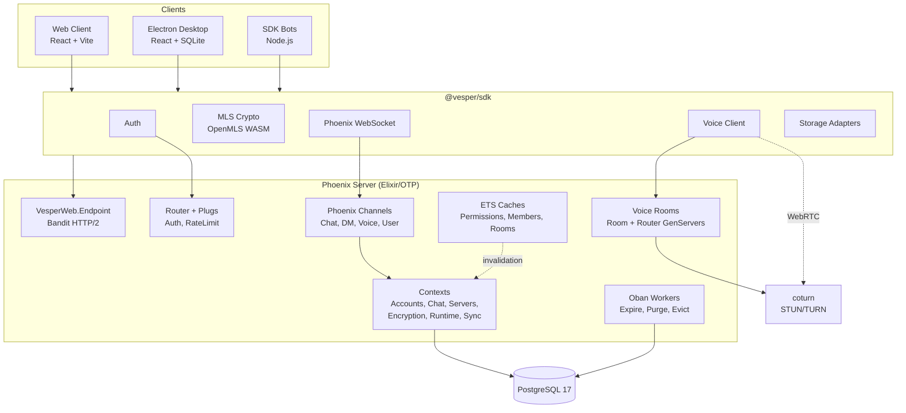
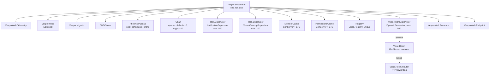
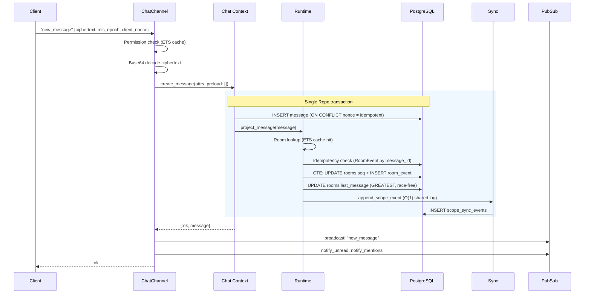
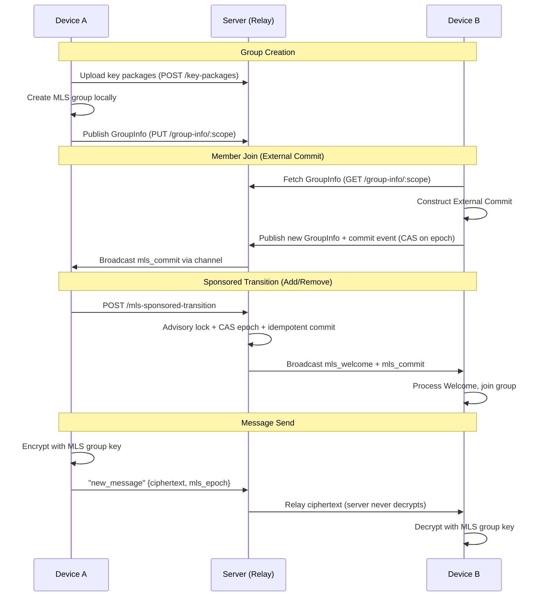
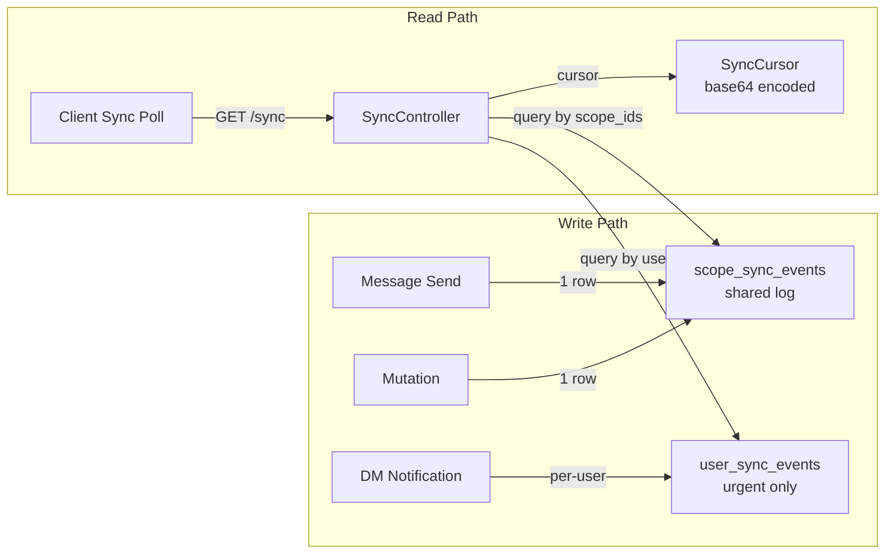
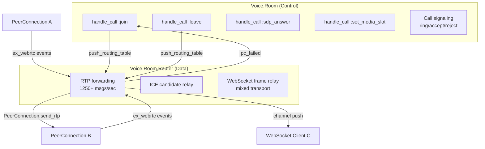
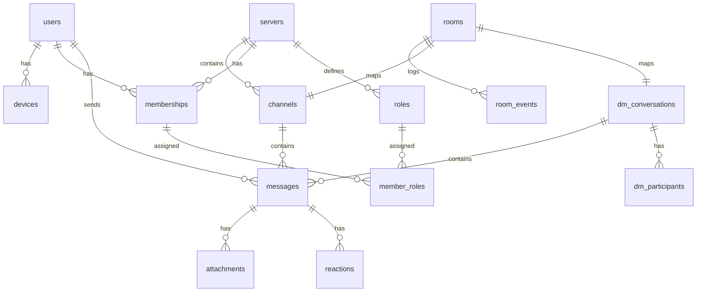

# System Architecture

> See also: [Project Overview](project-overview-pdr.md) | [API Reference](api-reference.md) | [Code Standards](code-standards.md)

## High-Level Components

## OTP Supervision Tree

## Message Send Flow

The hot path for sending a message. All DB operations are wrapped in a single `Repo.transaction` for all-or-nothing atomicity.

**Query count per message: 7** (message INSERT, BEGIN, idempotency check, CTE seq+event, room update, sync insert, COMMIT)

**Chaos hardening:**
- Idempotent via `client_nonce` partial unique index — safe retries
- All-or-nothing transaction — no orphaned messages
- `GREATEST()` for last_message_seq — race-free under concurrent sends
- CTE combines seq increment + event insert atomically — no seq gaps

## MLS Encryption Architecture

The server is an untrusted relay. All encryption/decryption happens client-side via OpenMLS WASM.

**Key protection mechanisms:**
- GroupInfo publish uses CAS (compare-and-swap) on `previous_epoch`
- Max epoch delta check (`@max_epoch_delta = 1000`) prevents inflation attacks
- Advisory locks serialize concurrent group state changes
- Idempotency keys prevent duplicate commits on retry

## Sync Architecture

Replaced per-user fan-out (O(N) writes) with shared event log (O(1) writes).

**Design:**
- `scope_sync_events`: append-only log, 1 row per scope event (not per user)
- `user_sync_events`: per-user urgent events (DM messages, mentions only)
- Clients poll with opaque cursor (synced_at + event_id, 1-second lookback)
- Scope changes resolved at read time by joining against user's memberships

## Voice Room Architecture

Two-process design separates control plane from data plane.

**Transport modes:**
- **WebRTC** (default): PeerConnection per participant, SDP/ICE negotiation, RTP forwarding
- **WebSocket**: No PeerConnection needed, frames relayed via Phoenix channel push
- **Mixed**: WebRTC and WebSocket participants coexist, Router bridges between them

## ETS Caching Layer

Three ETS caches reduce DB queries on hot paths:

| Cache | Table | Key | Value | Invalidation |
|-------|-------|-----|-------|-------------|
| PermissionsCache | `:vesper_permissions_cache` | `{user_id, server_id}` | permissions bitfield | PubSub on role change |
| MemberCache | `:vesper_member_cache` | `server_id` | MapSet of user_ids | PubSub on join/leave |
| RoomCache | `:vesper_room_cache` | `{:channel\|:dm, scope_id}` | Room struct (immutable fields) | Never (immutable) |

**PermissionsCache** reads are lock-free (ETS `:read_concurrency`). On cache miss, the calling process queries DB directly and writes to ETS — no GenServer serialization bottleneck.

## Data Model Overview

**Key relationships:**
- Each channel/DM has exactly one Room (event sourcing container)
- Messages belong to either a channel OR a conversation (CHECK constraint)
- Room events reference messages for the event stream
- Permissions computed from roles via bitfield ORing with channel-level overrides
